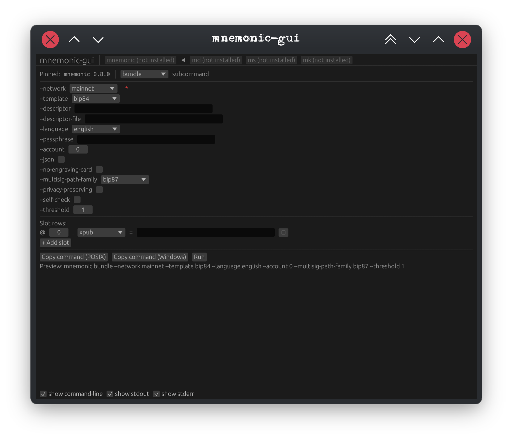
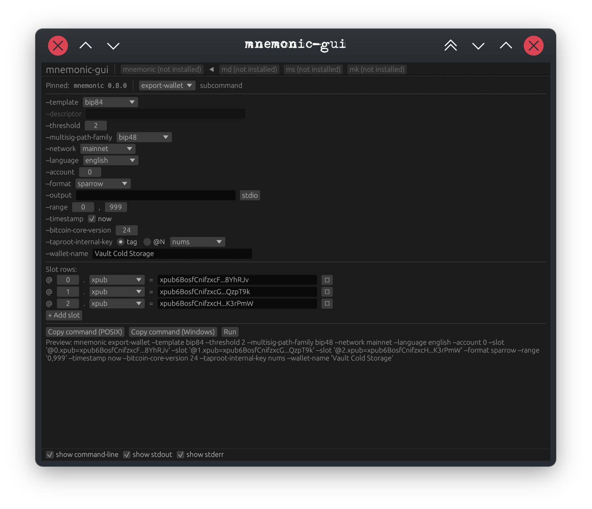
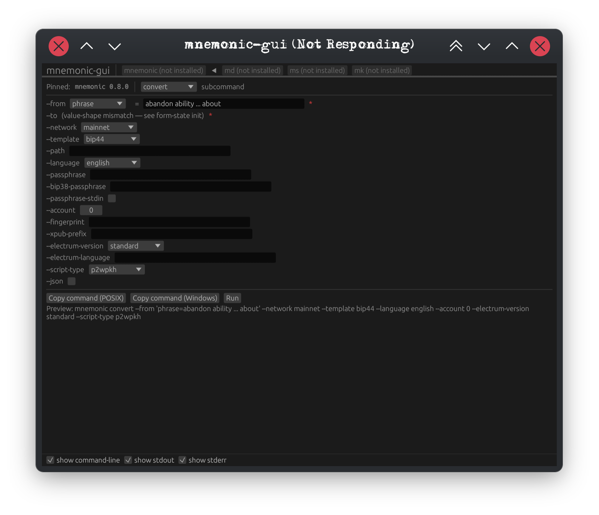

# mnemonic-gui

Cross-platform GUI overlay for the m-format constellation CLIs (`mnemonic`,
`md`, `ms`, `mk`). Built with [`egui`](https://github.com/emilk/egui); single
statically-linked binary per platform (Linux x86_64/aarch64, macOS x86_64/ARM,
Windows x86_64).

`mnemonic-gui` is a strict overlay — it assembles command-line invocations
from form input, runs the underlying CLI as a subprocess, and renders stdout
+ stderr verbatim. It does NOT parse, transform, or interpret CLI output
beyond display. The CLI remains the byte-exact source of truth.

## Status

Released `mnemonic-gui-v0.3.0` on 2026-05-15. v0.3 catches the GUI
up to `mnemonic-toolkit-v0.13.0` with 5 new `mnemonic` subcommand
surfaces (`slip39-split` / `slip39-combine` / `seed-xor-split` /
`seed-xor-combine` / `final-word`), a v0.10..v0.13 toolkit drift
correction for `bundle` / `verify-bundle` / `convert` /
`derive-child`, and 2 latent v0.2 bug fixes (repeating-secret argv
routing; `gui-schema`-JSON-preferred schema-mirror gate). See
[`design/agent-reports/`](design/agent-reports/) for the
phase-by-phase build logs and [`CHANGELOG.md`](CHANGELOG.md) for
the full release notes.

## Install

The fastest path is the constellation installer in the toolkit repo,
which installs the GUI + all four sibling CLIs at a pin-coherent set
of tags:

```sh
sh -c "$(curl -fsSL https://raw.githubusercontent.com/bg002h/mnemonic-toolkit/master/scripts/install.sh)"
```

See `scripts/install.sh --help` (after `git clone bg002h/mnemonic-toolkit`)
for per-component flags.

To install just the GUI from source at the pinned tag:

```sh
cargo install --locked --git https://github.com/bg002h/mnemonic-gui --tag mnemonic-gui-v0.28.0 mnemonic-gui
```

The GUI subprocess-runs the four sibling CLIs. If you skip the
constellation installer, install each one separately (pinned tags
match [`pinned-upstream.toml`](pinned-upstream.toml)):

```sh
cargo install --locked --git https://github.com/bg002h/mnemonic-toolkit     --tag mnemonic-toolkit-v0.47.3           mnemonic-toolkit
cargo install --locked --git https://github.com/bg002h/descriptor-mnemonic  --tag descriptor-mnemonic-md-cli-v0.6.2  md-cli
cargo install --locked --git https://github.com/bg002h/mnemonic-secret      --tag ms-cli-v0.7.0                      ms-cli
cargo install --locked --git https://github.com/bg002h/mnemonic-key         --tag mk-cli-v0.7.0                      mk-cli
```

Tabs for CLIs not present on `$PATH` are greyed at launch.

## Screenshots

`mnemonic bundle` (the seed-engraving primary flow):



`mnemonic export-wallet` — Sparrow multisig descriptor with 3 cosigner xpubs in the SlotEditor:



`mnemonic convert` — `--from <node>=<value>` composite widget showing the BIP-39 phrase → entropy conversion:



## First launch (unsigned binaries)

v0.1.0 binaries are not code-signed; first-launch instructions:

- **macOS:** see [`docs/onboarding/macos-gatekeeper-walkthrough.md`](docs/onboarding/macos-gatekeeper-walkthrough.md)
- **Windows:** see [`docs/onboarding/windows-smartscreen-walkthrough.md`](docs/onboarding/windows-smartscreen-walkthrough.md)

Code-signing is deferred to v0.2 (see `FOLLOWUPS.md`
`gui-code-signing-mac-developer-id` and `gui-code-signing-windows`).

## Design

Architecture: schema-driven generic form overlay; one bespoke `SlotEditor`
composite widget for the `--slot @N.<subkey>=<value>` repeating grammar.
10-phase build plan with per-phase TDD + architect-reviewer-until-0C/0I
discipline (brainstorm / SPEC / IMPL_PLAN converged 2026-05-12).

Per-phase build logs live under [`design/agent-reports/`](design/agent-reports/).

## License

MIT — see `LICENSE`.
